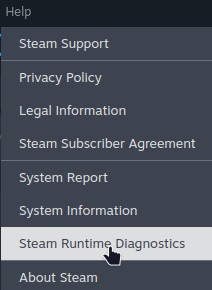
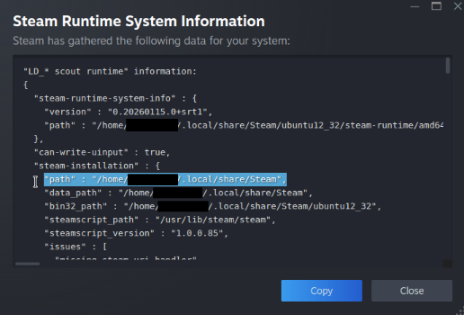

# Proton 10 Experimental Bleeding Edge with Hoshino Lina's Patch
## Custom patched Proton for the Unity extreme memory leak that occurs with some version of mono's garbage collector

This is a fork of [Wine-TKG-Git](https://github.com/Frogging-Family/wine-tkg-git) that includes a patch by Hoshino Lina that fix's a bug in Wine that can lead to extreme memory leak in some version's of mono's garbage collector which is used in some versions of Unity.

Specifically, this is intended to fix things for Warudo and other software that uses those specific versions of Unity/Mono GC.

This also includes some specific workarounds for Warudo to make launching it as simple as possible, and prevent a slow memory leak.

## Notes

The ideal solution would be a fix applied directly to Wine and adopted in to Valve Wine, and for software using that Unity/Mono GC library to upgrade to a newer version of the GC library that handles these exceptions without the leak.

Unfortunately it can takes months or more to get a fix like this in to the Wine source and then in to Valve's Wine source, and then in to a version of Proton that is easily accessible for users.

This works as a stop-gap solution until all of that happens.

## Usage

1. **Download the latest release:**
- [Valve Proton v4](https://github.com/madalee-com/wine-tkg-git-lina-unity-leak-fix/releases/tag/v4-tkg-valve-r2) 

2. **Extract the zip to the compatability tools path:**
- For directly installed Wine: `~/.local/share/Steam/compatibilitytools.d/` or `~/.steam/<something>/Steam/compatibilitytools.d/`
- For Flatpack Wine: `~/.var/app/com.valvesoftware.Steam/.local/share/Steam/compatibilitytools.d/`
- For other installation methods, you can find your compatabilitytools.d path by:
    1. In Steam, click "Help->Steam Runtime Diagnostics"
    2. In the window that opens look for "path" under steam installation
    3. The correct path should be `<path>/compatibilitytools.d`

         
3. **Restart Steam if it's already running**

### If you are trying to use Spout2PW
You may get an error when starting Warudo with spout2pw saying **"Installation unsuccessful"**.
If this happens:
- Switch to Proton Experimental
- Try to start Warudo(it's okay if it crashes, just so long as Spout gets setup and says **"Installation successful"**).
- Then switch back to this patched Proton and everything should work.

## Acknowledgements

- 99.9% of this project is: https://github.com/Frogging-Family/wine-tkg-git
- [Hoshino Lina](https://github.com/hoshinolina) for making the patch
- [AdalynBlack](https://github.com/AdalynBlack) for helping to isolate the actual bug
- [Madalee](https://github.com/madalee-com) for putting this fork together

